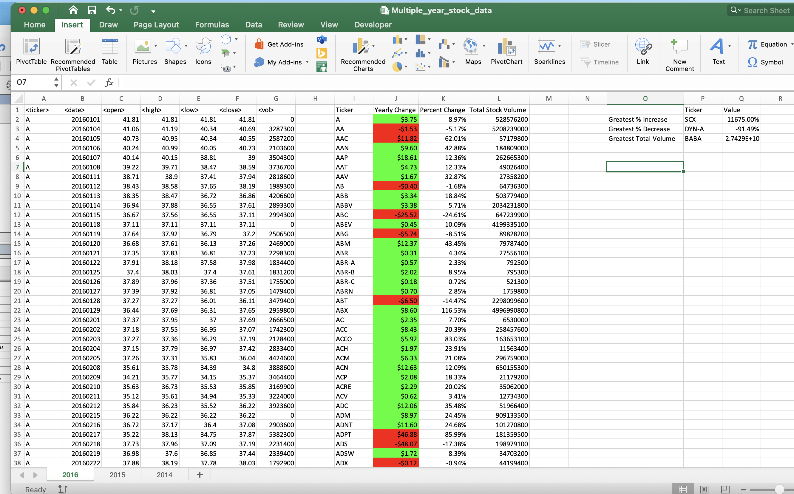

# vba-DataAnalysis-StockMarket

#Creation and analysis of Real Stock Data:

### Files

* [alphabetical_testing.xlsx) - Used as a smaller file to develop the scripts.

* [Multiple_year_stock_data.xlsx) - Used to Run the scripts on this data to generate a final report.

* [Various *.png files showing the results)

* [.vbs and .txt file showing the final Excel- vba coding used. ) Use of global variables, and functions within the module

* Note: VBA coding created with 'Excel: 2019, version 16.52'

* Note: Calculations take some time depending on your system, a message box is used to inform the user that the script is complete.

* ASSUMPTIONS: Percent change: when first open price is zero, use the next open price that is not a zero
                               when open price = close price  the percent change for the year is 0%
               Max and Min values: get one max / min value, code does not handle multiple max/min values that are the same.
               Data: in all tabs are setup the same way for each year. No Sorts needed to be done. Data did not need to be cleaned.

### Stock Market Analyst

## Creation of the summary stock columns:

* Created a module to loop through all the stocks for one year and output the following information:

  * The ticker symbol.

  * Yearly change from opening price at the beginning of a given year to the closing price at the end of that year.

  * The percent change from opening price at the beginning of a given year to the closing price at the end of that year.

  * The total stock volume of the stock.

* Conditional formatting was used to highlight positive changes in green and negative changes in red.

* The results are shown in png files in the repo.

## More Analysis

* Created columns to return the stock with the "Greatest % increase", "Greatest % decrease" and "Greatest total volume" for each year. 

* The script allows it to run on every worksheet, i.e., every year, just by running the VBA script once.

- - -
data xlsx files provided by Trilogy

